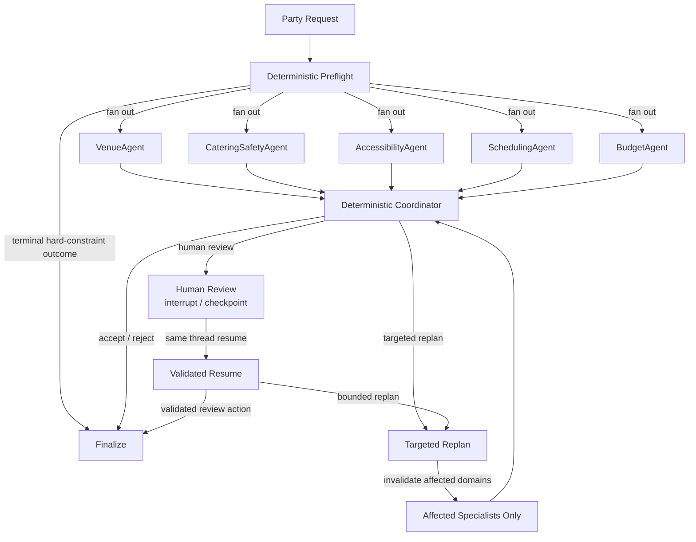
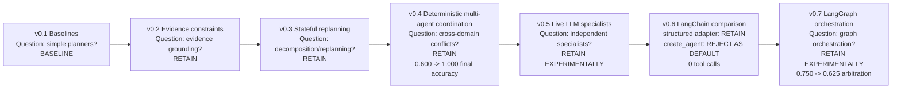

# PartyPilot

PartyPilot is an experimental multi-agent planning system for testing when coordination, decomposition, and orchestration justify their added cost.

Evidence before complexity is the project rule: add one capability, measure it, and then retain it, keep it experimental, or reject it.

## At a Glance

- Research question: when does multi-agent coordination outperform a simpler planner enough to justify added cost and complexity?
- Current experimental orchestration path: v0.7 LangGraph orchestration; the imperative orchestration backend remains the compatibility/default comparison path.
- Strongest retained results: v0.4 deterministic coordination and the v0.6 structured LangChain adapter; v0.5 live specialists and v0.7 LangGraph orchestration remain experimental.
- Strongest negative result: v0.6 `create_agent` produced zero tool calls in the canonical run and was not promoted as default.
- Canonical evidence: [v0.4](evals/results/v0_4/multi_agent/20260811T060908Z/v0_4_multi_agent.md), [v0.5](evals/results/v0_5/llm_multi_agent/20260812T060624Z/v0_5_llm_multi_agent.md), [v0.6](evals/results/v0_6/langchain/20260813T042641Z/v0_6_langchain_controlled_evaluation.md), [v0.7](evals/results/v0_7/langgraph/20260813T164446Z/20260813T164446Z/v0_7_controlled_orchestration_evaluation.md)

## Why This Project Exists

PartyPilot is not a generic party-planning app.
It is a research system for studying a specific question:

When does multi-agent coordination improve real decision quality enough to earn its operational overhead?

The repository therefore centers on measurable planning behavior:

- deterministic feasibility and constraint checking
- evidence-grounded decision-making
- stateful replanning
- live specialist execution
- orchestration backends that can be compared without changing the underlying PartyPilot semantics

## Research Question

PartyPilot investigates the progression:

`simplest baseline -> measurable failure -> add one capability -> evaluate -> retain / retain experimentally / reject`

The system is designed to separate three things that are often conflated:

- the quality of the planning semantics
- the quality of the orchestration/control flow
- the quality of the model or adapter used by each specialist

That separation makes the project useful for architecture decisions instead of just demoing a prompt chain.

## Key Findings

- v0.1 established the deterministic baseline: 24 scenarios, `0.875` feasibility accuracy, `1.000` hard-constraint validity, `0.923` no-feasible-plan accuracy, and `0.059 ms` mean latency.
- v0.2 retained evidence grounding with live retrieval and constraint extraction: 24 scenarios, `0.875` feasibility accuracy, `1.000` grounded-decision accuracy, `1.000` source-attribution accuracy, and `1.000` derived-constraint accuracy.
- v0.3 showed that targeted replanning can preserve correctness while reducing recomputation: `18` recomputed decisions for targeted replanning versus `34` for full replanning, with equal final-state correctness.
- v0.4 demonstrated deterministic multi-agent coordination: `1.000` final decision accuracy, `1.000` evidence-grounded arbitration accuracy, `50` specialist calls, and `80` coordination checks on the 10-scenario benchmark.
- v0.5 introduced real independent live LLM specialist execution: final decision accuracy stayed at `0.700`, evidence-aware arbitration remained part of the architecture, and provider reliability remained a major limitation in the live run.
- v0.6 retained the LangChain structured adapter, while the LangChain `create_agent` variant was rejected as the default after zero tool calls and no decision-quality improvement.
- v0.7 retained LangGraph experimentally, then a post-hoc audit classified the comparison as `VALID_BUT_DIFFERENT_WORK_POLICY` because `12` of `30` scenario-runs short-circuited in deterministic preflight, skipping `60` specialist executions and yielding `90` LangGraph specialist invocations versus `150` imperative invocations.

## Current Architecture

> PartyPilot separates domain semantics from orchestration. Specialists execute independently, while deterministic coordination and hard constraints remain authoritative.



LangGraph owns control flow; PartyPilot owns semantics.

The imperative orchestration backend remains the compatibility/default comparison path.
LangGraph is retained experimentally.
Deterministic hard constraints remain authoritative.

## Negative Results

Not every explored idea was promoted.

The clearest negative result is the v0.6 LangChain `create_agent` variant:

- a bounded tool-using implementation existed
- the canonical evaluation recorded zero tool calls
- it did not improve decision quality over the structured adapter path
- it was not promoted to the default
- no prompt tuning was performed afterward to manufacture tool use

That result is important because it shows the project is willing to reject more complex mechanisms when the evidence does not support them.

## Research Timeline

- v0.4 deterministic multi-agent coordination: [canonical report](evals/results/v0_4/multi_agent/20260811T060908Z/v0_4_multi_agent.md)
- v0.5 live LLM specialists: [canonical report](evals/results/v0_5/llm_multi_agent/20260812T060624Z/v0_5_llm_multi_agent.md)
- v0.6 LangChain structured adapter: [canonical report](evals/results/v0_6/langchain/20260813T042641Z/v0_6_langchain_controlled_evaluation.md)
- v0.7 LangGraph orchestration backend: [canonical report](evals/results/v0_7/langgraph/20260813T164446Z/20260813T164446Z/v0_7_controlled_orchestration_evaluation.md)

## Research Evolution

> baseline -> measured failure -> capability -> evaluation -> disposition
>
> evidence before complexity



PartyPilot adds one capability at a time and keeps it only when the measured evidence justifies the added complexity.

## System Evolution

| Version | Research question | Capability introduced | Evidence / result | Decision |
|---|---|---|---|---|
| v0.1 | Can a transparent deterministic planner establish a correctness baseline? | Structured resources, deterministic filtering, deterministic constraint validation | 24 scenarios; `0.875` feasibility accuracy; `1.000` hard-constraint validity; `0.923` no-feasible-plan accuracy; `0.059 ms` mean latency | Retain as the reference baseline |
| v0.2 | Does evidence grounding improve planning without loosening correctness? | BM25 retrieval plus live Ollama-backed constraint extraction | 24 scenarios; `0.875` feasibility accuracy; `1.000` grounded-decision, source-attribution, and derived-constraint accuracy; plain BM25 preferred over semantic/RRF variants | Retain the BM25 evidence-grounded path |
| v0.3 | Can stateful replanning reduce unnecessary recomputation? | Planning state, dependency tracking, targeted replanning | Final-state correctness remained `1.000`; targeted replanning recomputed `18` decisions versus `34` for full replanning; reduction ratio `0.471` | Retain targeted replanning |
| v0.4 | Does deterministic multi-agent coordination improve cross-domain conflict handling? | Minimal specialist coordination with a deterministic coordinator | `1.000` final decision accuracy; `1.000` evidence-grounded arbitration; `50` specialist calls; `80` coordination checks | Retain deterministic specialist coordination |
| v0.5 | Do live independent LLM specialists work as real agents? | Five live specialists with independent provider calls and failure isolation | Final decision accuracy `0.700`; live specialist execution was real and independent rather than simulated | Retain live specialists experimentally |
| v0.6 | Should LangChain become the specialist adapter layer? | LangChain structured adapter; LangChain `create_agent` variant explored | `langchain_chatollama` retained; `langchain_agent` rejected as default after zero tool calls and no decision-quality improvement | Retain the structured adapter; reject `create_agent` as default |
| v0.7 | Can LangGraph own orchestration without changing PartyPilot semantics? | LangGraph control-flow backend with preflight, fan-out, join, finalize, replan, and human review | `12` of `30` runs short-circuited in deterministic preflight, skipping `60` specialist executions and yielding `90` LangGraph specialist invocations versus `150` imperative invocations; audit classified the comparison as `VALID_BUT_DIFFERENT_WORK_POLICY` rather than a pure efficiency win | Retain experimentally, not as the primary claim of equivalence |

## What Counts as a Real Agent in PartyPilot

A PartyPilot agent is not a prompt label.
It is a specialist that:

- executes independently
- works from domain-scoped context
- invokes the model independently
- produces typed outputs
- fails in isolation when its provider or structured output fails
- leaves a trace that can be audited after coordination
- is coordinated only after its own execution completes

That definition is why the project treats live specialists as a real architectural milestone rather than a naming exercise.

## Engineering Highlights

- typed Python architecture
- framework-independent domain, application, and ports layers
- specialist protocol abstraction
- deterministic coordinator
- evidence provenance and citation validation
- bounded concurrency
- timeout and failure isolation
- structured-output validation
- state invalidation and revision tracking
- targeted replanning
- checkpointed human review
- strict msgpack checkpoint hardening
- canonical clean-tree evaluation provenance
- repeated balanced evaluations
- 500+ automated tests in the current `make check` run

## Repository Structure

- `README.md`: portfolio overview and project thesis
- `src/partypilot/`: domain, application, adapters, composition, and CLI runtime code
- `tests/`: offline and live-path regression coverage
- `docs/`: methodology notes, decisions, and supporting narrative; start with [docs/README.md](docs/README.md)
- `docs/decisions/`: concise ADRs with evidence-backed architecture decisions
- `docs/EXPERIMENTAL_METHOD.md`: methodology note for the project’s reasoning discipline
- `evals/`: evaluation runners, guides, and canonical artifacts; start with [evals/README.md](evals/README.md)
- `data/`: benchmark datasets and evidence fixtures
- `Makefile`: local workflow entry points
- `pyproject.toml`: packaging and tool configuration

## Running Locally

Start from the repository root.

```bash
python -m venv .venv
source .venv/bin/activate
python -m pip install -e '.[dev]'
make check
```

For live smoke runs, make sure Ollama is available and `PARTYPILOT_OLLAMA_MODEL` is set.

Useful commands:

```bash
make smoke-ollama
make smoke-constraint-extractor
make smoke-multi-agent
make smoke-langchain-multi-agent
make smoke-langchain-agents
make smoke-langgraph-review
```

## Reproducing Evaluations

The canonical evaluation entry points are:

```bash
make eval-v02
make eval-v03-replanning
make eval-v04-multi-agent
make eval-v05-llm-multi-agent
make eval-v06-langchain
make eval-v07-controlled-orchestration
```

Artifacts for the current portfolio pass are stored under `evals/results/`, including:

- `evals/results/v0_1/...`
- `evals/results/v0_2/...`
- `evals/results/v0_3/...`
- `evals/results/v0_4/...`
- `evals/results/v0_5/...`
- `evals/results/v0_6/...`
- `evals/results/v0_7/...`

The canonical v0.7d controlled orchestration artifacts are in:

- `evals/results/v0_7/langgraph/20260813T164446Z/20260813T164446Z/v0_7_controlled_orchestration_evaluation.json`
- `evals/results/v0_7/langgraph/20260813T164446Z/20260813T164446Z/v0_7_controlled_orchestration_evaluation.md`
- `evals/results/v0_7/langgraph/20260813T164446Z/20260813T164446Z/accounting_audit.md`

## Limitations

- The benchmark suite is intentionally narrow and scenario-driven.
- Live model evaluations are sensitive to provider latency and timeout behavior.
- v0.7 is experimentally retained, not promoted as a pure framework-efficiency win.
- The canonical comparison is useful, but it is not a claim that every backend performed identical work.
- PartyPilot does not claim that framework choice alone makes a system intelligent.

## What The Experiments Suggest

The evidence points to a recurring pattern:

- simple deterministic baselines are essential
- evidence grounding improves reliability before orchestration complexity is added
- targeted replanning is worth keeping when it reduces recomputation without losing correctness
- live specialists are meaningful only when their outputs remain typed, isolated, and auditable
- orchestration frameworks are best treated as control-flow infrastructure, not as a substitute for semantics
- more complex machinery should be retained only when it changes measured outcomes

In short, PartyPilot suggests that multi-agent coordination should be justified by measurable benefit, not by architectural fashion.

## Future Research

- compare orchestration backends under equal-work policies
- study when tool use materially improves specialist reliability
- extend targeted replanning while preserving traceability
- continue hardening checkpoint and resume semantics
- keep separating semantic gains from framework effects
- evaluate whether additional specialist decomposition improves specific failure modes without inflating overhead
